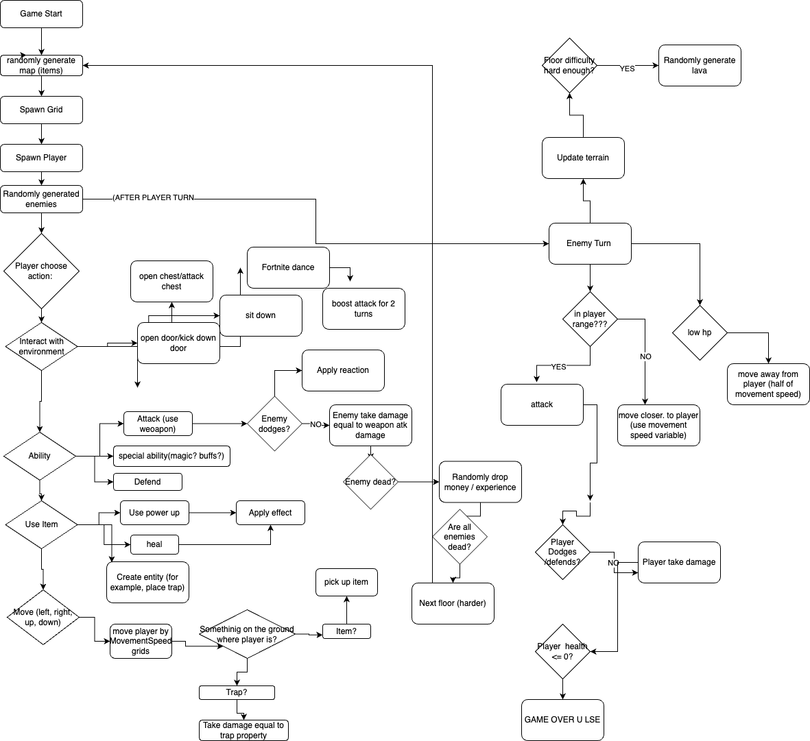

# CP2-Group-project

The Group project for our Computer Programming 2 class.

# Project

We are doing turn based rogue like video game.

you can beat room to go to next room of random enemies

every action happens turn basedly

you can get powerups from defeatinig enemies

## Project Ideas

### Esolang (maybe)
Esolangs are "esoteric programming languages", specifically designed to be hard or wierd to program in to challenge the user's programming abilities. Some examples of esolangs can be found here: https://esolangs.org/wiki/Main_Page

### Videogame (probably)
A simple pixel-art turn-based Rogue-like  type game with vim style controls, new abilities you get are give you new attacks, defenses, turns, etc.
nethack style? https://www.nethack.org

### Cellular Automata RPG

nethack except everything is cellular automata

### Simple Cellular Automata (maybe)
A cellular autoamta is a 2-dimension grid of cells whose state evolves over time according to their neighbors. With cellular automata, you can create a complex and diverse array of different behavior. The Game of Life is a popular and simple example of a cellular automata. In the Game of Life, you can create strange and beautiful patterns like flying gliders, blinking oscillators, and even Conway's Game Of Life inside of Conway's Game of Life.

https://www.youtube.com/watch?v=C2vgICfQawE

### Data structures annd resources

No dialoge 

no story

We have gathering coins (int currency) and a marketplace (class)

Sprites: main character (pimage), with 2 skins (rick from rick and morty and the banana guy from fortnite), at least 3 types of enemy (classes), 5 different weapons (class), background tiles (pimage, class) (9x9)

videos (these will be placeholders): door open, break down door, die, take the L

sound: background music, and shooting
